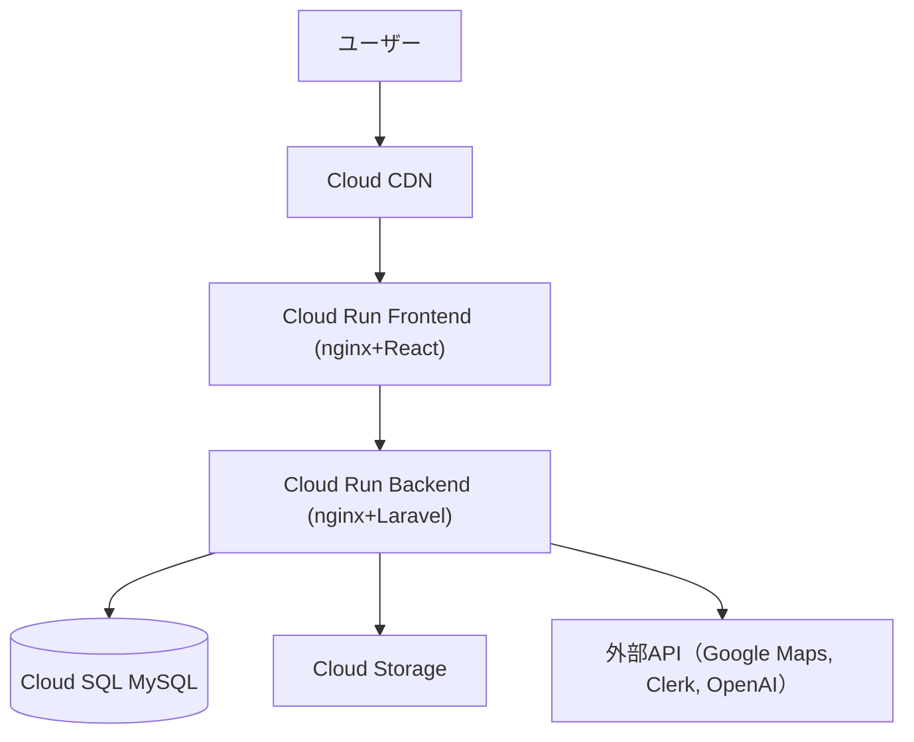

# Travel Memory（TraMemo）

## 概要
Travel Memory（TraMemo）は、旅行記録を地図と写真で管理・共有できるWebサービスです。地図上でのルート表示や写真付きの詳細記録、SNS機能を通じて、旅行の思い出を豊かに保存・活用できます。

---

## 特徴
- 旅行記録の作成・編集・削除（写真・地図・コメント付き）
- 地図連携（Google Maps APIによるルート表示）
- SNS機能（いいね・お気に入り・コメント）
- 画像管理（GCP Cloud Storage連携、サムネイル自動生成）
- AI連携（ChatGPT APIによる旅行提案）
- 検索・フィルター機能

---

## 技術スタック
- **フロントエンド**: React 18, Vite, TypeScript, TailwindCSS, shadcn/ui
- **バックエンド**: Laravel 12, PHP 8.1, MySQL 8.0
- **インフラ**: GCP（Cloud Run, Cloud SQL, Cloud Storage, Cloud CDN, Secret Manager, Cloud Monitoring/Logging）
- **インフラ・外部サービス**: Google Maps API, OpenAI API, Clerk
- **AI駆動開発**: Cursor（コーディング・設計支援）, GitHub Copilot（コーディング支援）, V0（UIデザイン支援）

---

## システム構成図


---

## セットアップ方法（ローカル開発）
1. このリポジトリをクローン
2. 必要な環境変数ファイル（.env等）を作成
3. 依存パッケージをインストール
    - バックエンド: `cd src && composer install`
    - フロントエンド: `cd frontend && npm install`（※frontendディレクトリがある場合）
4. DBの初期化・マイグレーション
    - `php artisan migrate --seed`
5. Dockerを利用する場合
    - `docker-compose up -d`
6. サーバー起動
    - バックエンド: `php artisan serve`
    - フロントエンド: `npm run dev`

---

## ディレクトリ構成

### バックエンド（Laravel）
```
TraMemo_prot_backend/
├── src/                    # Laravelアプリケーション
├── infra/
│   ├── gcp/               # GCP設定ファイル
│   │   ├── terraform/     # Terraform設定
│   │   ├── docker/        # Docker設定
│   │   └── scripts/       # デプロイスクリプト
│   └── docker-compose.yml # 開発環境用
└── 設計書/                 # 設計ドキュメント
```

### フロントエンド（React）
```
TraMemo_prot_frontend/
├── src/                    # Reactアプリケーション
│   ├── api/               # API通信関連
│   ├── components/        # 再利用可能なコンポーネント
│   │   └── ui/           # shadcn/ui基本コンポーネント
│   ├── constants/         # 定数定義（都道府県、国名など）
│   ├── lib/              # ユーティリティ関数
│   ├── pages/            # ページコンポーネント
│   └── assets/           # 静的ファイル（画像など）
├── infra/
│   └── gcp_front/        # フロントエンド用GCP設定
│       └── docker/       # Docker設定（Nginx + React）
└── public/               # 公開ファイル

```

---

## 設計ドキュメント
詳細な設計・仕様については[設計書フォルダ](https://github.com/lay-2025/TraMemo_prot_backend/tree/main/設計書/)を参照してください。

### 設計種別分類例

| 番号 | カテゴリ                | 主な内容例                                 |
|------|------------------------|--------------------------------------------|
| 100  | サービス概要・全体設計  | サービス概要、システム構成図、技術スタック |
| 200  | ドメイン・業務設計      | DDD設計、ユースケース、エンティティ定義    |
| 300  | データベース設計        | ER図、テーブル定義、マイグレーション設計   |
| 400  | API・インターフェース   | API仕様書、エンドポイント定義              |
| 500  | インフラ・デプロイ       | インフラ構成、デプロイ手順、CI/CD設計      |
| 600  | 認証・セキュリティ      | 認証設計、セキュリティ要件                 |
| 700  | テスト・品質管理        | テスト戦略、テスト仕様、品質管理           |
| 800  | 運用・保守              | 運用手順、設計書管理ガイド、FAQ            |
| 900  | その他・共通            | 用語集、変更履歴、参考資料                 |

---

## ライセンス
MIT

---

## 作者
- 